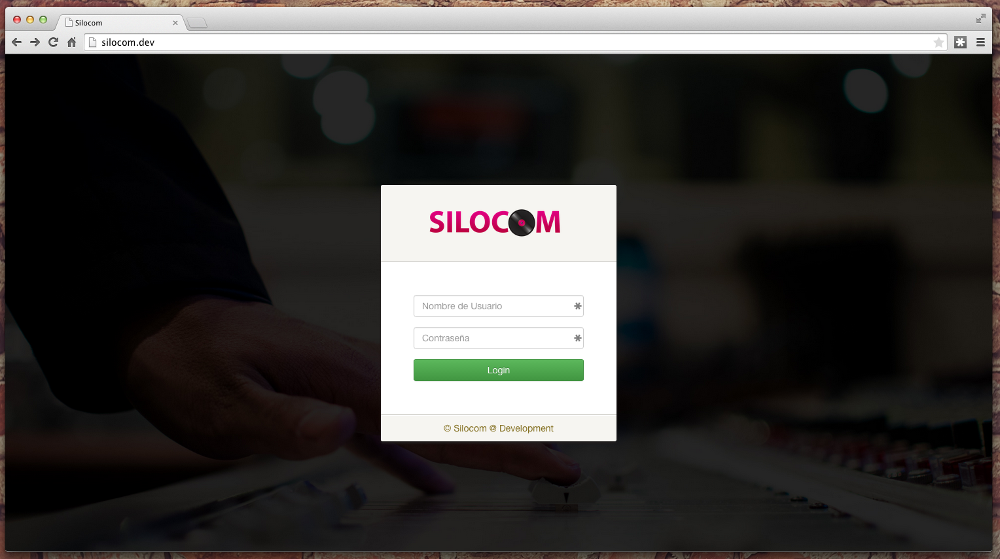

### Proyecto SILOCOM
##### Aplicación en Desarrollo

###### Iniciando
Como inicio, mencionare algunos cambios que fueron aplicados al sistema para un mantenimiento más rápido y eficiente, es por ello, que por motivos de seguridad fue cambiado el nombre al directorio **applications** por **app** y **system** por **vendor**, además de incluyo un directorio llamado **public** en donde se almacena todos los complementos de la aplicación.

Por otra parte, antes de utilizar la aplicación clonada desde este repositorio es necesario cargar unos complementos utilizando el manejador de paquetes `bower` para realizar la instalación de: 

1. jQuery - `bower install jquery`.
2. Bootstrap - `bower install bootstrap`.

###### Licencia de Proyecto

###### Screenshots

Copyright (c) 2015 Paloma Corona Huerta